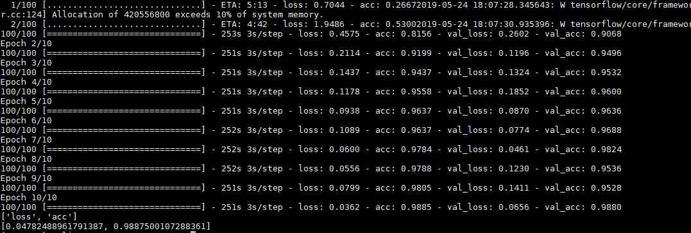

```{r setup, include=FALSE}
knitr::opts_chunk$set(echo = TRUE)
```

# Introduction, Objective, and Data description
The Aerial Cactus Identification data were generated to help assessing the impact of climate change. It contains a very large number of 32 x 32 thumbnail images. They are processed to have a uniform size. These images can have cactus or not.

The goal of this report is to predict a best model to classify whether the image has a cactus or not. In other words, our group aims to classify these images in a way that could carry similar features in order to facilitate the task of finding a classifier which is able to predict the outcome of whether having cactus in the image or not.

The data has 17500 observations. It contains two variables; first variable is the image id, and the second variable is the binary output for whether this image has a cactus or not. The binary system was coded as 1 if it has cactus and 0 otherwise. Each of the image ids were listed as a file name each of which corresponded to a 32x32 pixel image in the dataset. We found that the data set was imbalanced by calculating the mean of the classes (1 for cactus, 0 for not cactus) in the data set which was 0.751. We randomly sampled the data into testing and traing subsets with 20% in the testing set and 80% in the training set. Sice our whole dataset was 17,500 observations this lead to 3,500 observations in the testinf set and 14,000 in the training set. We then split the training set further into training and validation sets for the purpose of tuning out classifier. We again used a 20/80 split and thus the validation set had 2,800 observations while the new traing set has 11,200 observations.

After splitting the data into subsets, as a sanity check, we checked that the class imbalance was preserved and found that in all subsets contained roughly 75% cactus classes.


# Feature Extraction

For the feature analysis we used the Histogram of Oriented Gradients (HOG) as the feature representation method and then ran the results through principal compenent analysis (PCA) to reduce the feature space. 

The goal of using Principal Component Analysis (PCA) is to find few variables that are sharing the same instances. Additionally, it is a good reduction technique for classification purposes. While doing this process, we tried to preserve the same structure (variance in our case) in the data set. We run PCA on the data by using R (See code section 4). PCA tries to find the highest eigenvalues, which will be used to project the data in the new structure, after constructing eigenvectors of covariance matrix.

In this analysis, we tried to find the lowest number of PC that can capture the highest variation of the data. Since we are performing a statistical analysis on the data after this technique, we were looking for at least 90% of the variance that is explained by variance. Otherwise, we could use 80% of the variance if we had applied only descriptive analysis. The cumulative proportion was the magnitude of variance that we were looking at.


The input image into the HOG feature generation is a rgb image with the dimensions of 32 * 32 * 3, We chose the HOG function with 4 cells and 6 orientations and the output feature vector is of size 96. We then took the output of this and put it through PC using the prcomp function. As shown from the results (see code section 4), the first PC has a variance of only 15%. Total number of Principal components were 96. The 90% of variance that we were targeting was captured at the 55th PC. 

# Classification Methodology

## Model Fitting

For this report we tried using both adaboost (using the gbm package shown in code section 5) and Convolutional Neural Networks (CNN) (shown in code section 7) all of which were trained on the 11,200 observations in the training set and then tested on the 2,800 observations in the validation set. Adaboost we used R with both the HOG and PCA feature extraction methods. For the CNN we had issues getting tensorflow to install on the GPU in the R framework so we had to run it using python.

We build a CNN model using keras to classify images. We did not use HOG or PCA feature extraction instead to pre-process the image data we have used keras ImageDataGenerator which process the resultant dataset into floating point tensors which is fed to our network model. 

We built our CNN model with Conv2D (superimposing the filter onto the image matrix outputting a feature map) and Maxpooling2D (extracting features from feature map resulting with a max value of each channel) stages with relu activation function. Since the output is a binary classification we have the final dense layer with 1 with sigmoid activation function. We compiled our model with binary cross entropy loss and defined with accuracy metrics. Finally, we fitted the model with our training data generator, validation data generator running 10 epochs (lifecycles). To reuse the model we saved the model. The model fit was evaluated by using the test generator dataset where we end up with a loss of 0.04 and an accuracy of 98.8%. 


## Results

After training the classifiers we found that the adaboost model had a 12.89% error rate on the validation set while the Convolutional Neual Net had a 1.13% error rate on the validation set. Thus, the CNN preformed much better than all the other models we have tried thus far. We also tried running the models from last weeks report (shown in code section 6) on the PCA reduced features and it made the svm error rate worse (7.32% to 9.18%) but made the random forest error rate better. (10.21% to 9.82%)

\pagebreak

# Appendix: R Code

## Code Section 1: Load packages & read data.

```
library(OpenImageR)

# dplyr causes issues with gbm model fitting so I didn't load it here
#library(tidyverse)

library(e1071)
library(randomForest)

library(fastAdaboost)
library(gbm)


# Generate files paths
#file_dir <- dirname(rstudioapi::getSourceEditorContext()$path)
file_dir <- "/home/finn/Documents/ST\ 538/big-data-group-1/Project\ 2"
train_path <- file.path(file_dir,"g1_train")
test_path <- file.path(file_dir,"g1_test")

# get training and testing file names
train_files <- list.files(train_path)
test_files <- list.files(test_path)
```


## Code Section 2: Setup Function for feature extraction

```
##########################################

# feature generation function
features <- function(file_path, file_name){
  path <- file.path(file_path, file_name)
  
  im <- readImage(path)
  #dim(im)
  
  im <- rgb_2gray(im)
  
  #imageShow(im)
  
  #intBl = resizeImage(im, width = 100, height = 100, method = 'bilinear')
  #dim(intBl)
  
  #im = im * 255
  
  hog <- HOG(im, cells = 4, orientations = 6)
  return(hog)
}
```

## Code section 3: Read Classifications and Transform data 

```
ans <- read_csv(file.path(file_dir,"train.csv"))

##########################################

# Setup column names
len<-length(features(train_path,train_files[1]))
cn<-character()
for(a in 1:len){
  cn <- append(cn,paste("x",as.character(a), sep = ""))
}
cn <- append(cn,"y")

# Extract features and append answer to y column
X <- matrix(NA, nrow=length(train_files), ncol=len+1)
i <- 1
for(file in train_files){
  X[i,] <- append(features(train_path,file),ans$has_cactus[ans$id==file])
  i <- i+1
}
colnames(X)=cn
# Convert to tibble (changes since dplyr causes errors)
#X <- as_tibble(X,colnames=cn)
#X <- X %>%
#  mutate(y = factor(y))
# Convert to data frame
X <- as.data.frame(X)
X$y <- as.factor(X$y)
```

## Code section 4: Run PCA

```
set.seed(Sys.time())
train_idx <- sample(1:nrow(X),11200)

pc <- prcomp(X[,!names(X) %in% c("y")])  # Eigen decomposition of Sample Covariance

summary(pc)
#found that 55 principle components accounted for 90% of the variance

# reduced to 55 Priciple components
Xpc = as.data.frame(pc$x[, 1:55])
Xpc$y = X$y
```

## Code section 5: Run gbm model on pc

```
X2 <- as.data.frame(Xpc)


X2$y <- as.character(X2$y)

adb <- gbm(y~.,data=X2[train_idx,], distribution = "adaboost", n.trees = 500)
adb_pred<-predict(adb,X2[-train_idx,],n.trees=500, type = "response")
adb_pred_1<-predict(adb,filter(X2[-train_idx,],y=="1"),n.trees=500, type = "response")
adb_pred_0<-predict(adb,filter(X2[-train_idx,],y=="0"),n.trees=500, type = "response")

class_con <- function(x){
  if(x >= .5){
    return("1")
  }
  if(x < .5){
    return("0")
  }
}

adb_pred <- lapply(adb_pred, class_con)
adb_pred_1 <- lapply(adb_pred_1, class_con)
adb_pred_0 <- lapply(adb_pred_0, class_con)

adb_err<- with(X2[-train_idx,],mean(y!=adb_pred))
adb_err_1<- with(filter(X2[-train_idx,],y=="1"),mean(y!=adb_pred_1))
adb_err_0<- with(filter(X2[-train_idx,],y=="0"),mean(y!=adb_pred_0))
# This gives error rate of 12.89%
# This gives cactus error rate of 4.78%
# This gives non cactus error rate of 28.9%
```

## Code section 6: Run the PCA features thtrough last weeks models

```
svm_model <- svm(y~.,data=Xpc, kernel="radial", cost=5, subset=train_idx)

svm_pred<-predict(svm_model,Xpc[-train_idx,])
svm_pred_1<-predict(svm_model,filter(Xpc[-train_idx,],y=="1"))
svm_pred_0<-predict(svm_model,filter(Xpc[-train_idx,],y=="0"))
svm_err<- with(Xpc[-train_idx,],mean(y!=svm_pred))
svm_err_1<- with(filter(Xpc[-train_idx,],y=="1"),mean(y!=svm_pred_1))
svm_err_0<- with(filter(Xpc[-train_idx,],y=="0"),mean(y!=svm_pred_0))
# This gives error rate of 9.18%
# 1 rate: 5.3%
# 0 rate: 21.07%


rf <- randomForest(y~.,data=Xpc, ntrees=1500, mtry=14, subset=train_idx)

rf_pred<-predict(rf,Xpc[-train_idx,])
rf_pred_1<-predict(rf,filter(Xpc[-train_idx,],y=="1"))
rf_pred_0<-predict(rf,filter(Xpc[-train_idx,],y=="0"))
rf_err<-with(Xpc[-train_idx,],mean(y!=rf_pred))
rf_err_1<- with(filter(Xpc[-train_idx,],y=="1"),mean(y!=rf_pred_1))
rf_err_0<- with(filter(Xpc[-train_idx,],y=="0"),mean(y!=rf_pred_0))
# This gives error rate of 9.82%
# 0 rate 33.72%
# 1 rate 1.99%
```

# Code section 7: CNN model using python (Not R)
```
import pandas as pd # data processing, CSV file I/O (e.g. pd.read_csv)
import os		#,cv2
from IPython.display import Image
from keras.preprocessing import image
from keras import optimizers
from keras import layers,models
from keras.applications.imagenet_utils import preprocess_input
import matplotlib.pyplot as plt
import seaborn as sns
from keras import regularizers
from keras.preprocessing.image import ImageDataGenerator
from keras.applications.vgg16 import VGG16
print(os.listdir("aci/"))
from PIL import Image
from keras.models import load_model

import numpy as np

train_dir="aci/train"

train=pd.read_csv('aci/train.csv')

train.head(5)
train.has_cactus=train.has_cactus.astype(str)
print('out dataset has {} rows and {} columns'.format(train.shape[0],train.shape[1]))
datagen=ImageDataGenerator(rescale=1./255)
batch_size=150
train_generator=datagen.flow_from_dataframe(dataframe=train[:12000],directory=train_dir,x_col='id',y_col='has_cactus',class_mode='binary',batch_size=batch_size,target_size=(150,150))
validation_generator=datagen.flow_from_dataframe(dataframe=train[12000:15000],directory=train_dir,x_col='id',y_col='has_cactus',class_mode='binary',batch_size=50,target_size=(150,150))
test_generator=datagen.flow_from_dataframe(dataframe=train[15000:],directory=train_dir,x_col='id',y_col='has_cactus',class_mode='binary',batch_size=batch_size,target_size=(150,150))
print(test_generator.samples)
print(validation_generator.samples)
print(train_generator.samples)

model=models.Sequential()
model.add(layers.Conv2D(32,(3,3),activation='relu',input_shape=(150,150,3)))
model.add(layers.MaxPool2D((2,2)))
model.add(layers.Conv2D(64,(3,3),activation='relu',input_shape=(150,150,3)))
model.add(layers.MaxPool2D((2,2)))
model.add(layers.Conv2D(128,(3,3),activation='relu',input_shape=(150,150,3)))
model.add(layers.MaxPool2D((2,2)))
model.add(layers.Conv2D(128,(3,3),activation='relu',input_shape=(150,150,3)))
model.add(layers.MaxPool2D((2,2)))
model.add(layers.Flatten())
model.add(layers.Dense(512,activation='relu'))
model.add(layers.Dense(1,activation='sigmoid'))
model.compile(loss='binary_crossentropy',optimizer=optimizers.rmsprop(),metrics=['acc'])
epochs=10

#history=model.fit_generator(train_generator,steps_per_epoch=100,epochs=10,validation_data=validation_generator,validation_steps=50)
#model.save('my_model_01.hdf5')

model = load_model('my_model_01.hdf5')
score=model.evaluate_generator(test_generator , steps=test_generator.samples//batch_size)	#model.predict_generator(test_generator,steps=1)
print(model.metrics_names)
print(score)
```

