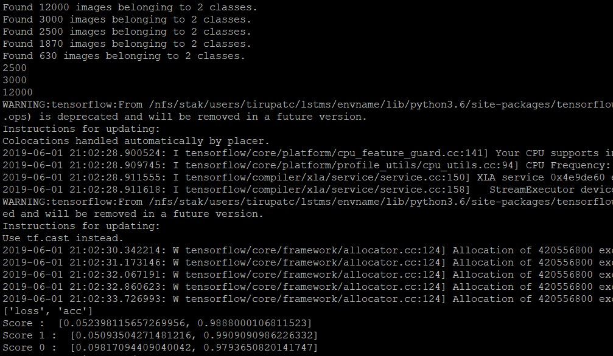

```{r setup, include=FALSE}
knitr::opts_chunk$set(echo = TRUE)
```

# Introduction
The Aerial Cactus Identification data were generated to help assessing the impact of climate change. It contains a very large number of 32 x 32 thumbnail images. They are processed to have a uniform size. These images can have cactus or not. As a team, each one of us have registered in the competition website that was provided so that we will be able to download the data and have an overview about the purpose of predicting them.

# Objective
The goal of this report is to predict a best model to classify whether the image has a cactus or not. In other words, our group aims to classify these images in a way that could carry similar features in order to facilitate the task of finding a classifier which is able to predict the outcome of whether having cactus in the image or not.

# Data
Data was provided to us by Dr. Sharmodeep through the Kaggle Aerial Cactus Identification Challenge. It has 17500 observations. It contains two variables; first variable is the image id, and the second variable is the binary output for whether this image has a cactus or not. The binary system was coded as 1 if it has cactus and 0 otherwise. Each of the image ids were listed as a file name each of which corresponded to a 32x32 pixel image in the dataset. We found that the data set was imbalanced by calculating the mean of the classes (1 for cactus, 0 for not cactus) in the data set which was 0.751. 

# Dividing the Dataset

We randomly sampled the data into testing and traing subsets with 20% in the testing set and 80% in the training set. Sice our whole dataset was 17,500 observations this lead to 3,500 observations in the testinf set and 14,000 in the training set. We then split the training set further into training and validation sets for the purpose of tuning out classifier. We again used a 20/80 split and thus the validation set had 2,800 observations while the new traing set has 11,200 observations.

After splitting the data into subsets, as a sanity check, we checked that the class imbalance was preserved and found that in all subsets contained roughly 75% cactus classes.

# Feature Extraction

For the feature analysis we used the Histogram of Oriented Gradients (HOG) as the feature representation method and then ran the results through principal compenent analysis (PCA) to reduce the feature space. 

The goal of using Principal Component Analysis (PCA) is to find few variables that are sharing the same instances. Additionally, it is a good reduction technique for classification purposes. While doing this process, we tried to preserve the same structure (variance in our case) in the data set. We run PCA on the data by using R (See code section 4). PCA tries to find the highest eigenvalues, which will be used to project the data in the new structure, after constructing eigenvectors of covariance matrix.

In this analysis, we tried to find the lowest number of PC that can capture the highest variation of the data. Since we are performing a statistical analysis on the data after this technique, we were looking for at least 90% of the variance that is explained by variance. Otherwise, we could use 80% of the variance if we had applied only descriptive analysis. The cumulative proportion was the magnitude of variance that we were looking at.

The input image into the HOG feature generation is a rgb image with the dimensions of 32 * 32 * 3, We chose the HOG function with 4 cells and 6 orientations and the output feature vector is of size 96. We then took the output of this and put it through PC using the prcomp function. As shown from the results (see code section 4), the first PC has a variance of only 15%. Total number of Principal components were 96. The 90% of variance that we were targeting was captured at the 55th PC.

# Model Fitting

In the last report we compaired the results of using HOG with PCA to just using HOG and we found that adding in PCA improved the results of the random forest and adaboost models but made the svm model prefome worse versus just using the HOG features. Thus, in this report when we generate the test results we will use PCA for the random forest and adaboost models but not on the svm model. The Convolutional Neural Network approach generates it's own feature extraction layers thus neither HOG or PCA is applied to the inputs for that model.

In R we made the adaboost model using the gbm package, the random forest model using the randomForest package, and the svm using the e1071 package. We build a CNN model in python using keras to classify images. To pre-process the image data we have used keras ImageDataGenerator which process the resultant dataset into floating point tensors which is fed to our network model. We built our CNN model with Conv2D (superimposing the filter onto the image matrix outputting a feature map) and Maxpooling2D (extracting features from feature map resulting with a max value of each channel) stages with relu activation function. Since the output is a binary classification we have the final dense layer with 1 with sigmoid activation function. We compiled our model with binary cross entropy loss and defined with accuracy metrics. Finally, we fitted the model with our training data generator, validation data generator running 10 epochs (lifecycles).

# Test Results

We took the models trained in the last couple weeks and then used the test subset of the dataset to generate predictions and the compaired them to the answers to generate error rates which we used to compair the various models. (mdoel fitting and testing shown in code sections 5 and 6) We also examined the error rate for just the images including cactuses as well that the error rates for images not including cactuses.

For the adaboost model we found a test error rate of 10.23% with a test error rate of 27.48% for non-cactus and 4.71% for cactus. For the random forest model we found a test error rate of 9.11% with a test error rate of 30.66% for non-cactus and 2.19% for cactus. For the SVM model we found a test error rate of 6.86% with a test error rate of 16.04% for non-cactus and 3.92% for cactus.

For the non-CNN models it seems like svm is the clear winner with an overall test error rate less than 7% and with less class imbalance in the cactus/non-cactus error rates. Of the non-CNN models the only model that preformed better in any regard to the svm model was the random forest on cactus example but even then the gains where small (2.19% vs 3.92%) which in our opinion doesn't make up for that large class imbalance in the random forest model.

Overall though the CNN is clearly the best with an overall test error rate of 1.2%, a cactus test error rate of 0.09%, and a non-cactus test error rate of 2.06%. The class imbalance is still visable within the CNN model error rates but it is not nearly as drastic and the error rates are all considerably lower. Even with just 10 epochs the CNN outpreformed every other model by a large margin thus, tthe CNN seems like the best model for classifying images as cactuses.

# Obstacles

The data that we obtained from the aforementioned website was imbalanced. It has about 75% of the observations were cactus and 25% were non cactus. We saw in the error rates this likely had an effect on our models as every model had a better error rate for cactus examples than the error rates for non cactus examples with random forest model being particularly bad in this regard. 

Another obstacle that we run through was a technical issue. We had issues getting tensorflow installed on the GPU in the R framework to run Convolutional Neural Networks. Therefore, we had to spend some time figuring out how to run CNN in different software. Eventually, we decided to run it using python.

A minor obstacle was computational time. It usually took about 30-50 minutes to run through the various preprocessing and model training/tuning steps each time we wanted to run our code all the way through but this was at worst a minor inconvenience. However, given a larger dataset this might prove to be a huge hassle either requiring more time, more powerful computers, or a less computationally intense approach.

# Future Work

In terms of future work, we could increase the scope of the model. Instead of using binary outcome (1 for cactus, and 0 otherwise), it would be interesting to categorize the cactus into different types such as saguaro, cereus, ect. Though we would likely need larger resalution images for this task. We could also look to classify the images not just as cactus or no cactus but possibly with healty cactus, unhealthy cactus, and no cactus. We could also try to classify more than just cactuses but possible other types of plants as well. 

Most of out results seemed to have a class imbalance so in the future it could be fruitful to try using subsampling/upsmpling methods, such as SMOTE or Tomek links, to reduce this imbalance in the training data to potentially reduce this effect. We could then compair the results using these teqniques to the results from our analysis on the same test set to see if it improves our results.

Lastly, with more time we could always just spend more time tuning the layers in our CNN or running more epochs to try to improve the results from the CNN model. In our approach for the sake of time we only used 10 epochs which took a bit over an hour to train.

\pagebreak

# Appendix: R Code

## Code Section 1: Load packages & read data.

```
library(OpenImageR)

# dplyr causes issues with gbm model fitting so I didn't load it here
#library(tidyverse)

library(e1071)
library(randomForest)

library(fastAdaboost)
library(gbm)


# Generate files paths
#file_dir <- dirname(rstudioapi::getSourceEditorContext()$path)
file_dir <- "/home/finn/Documents/ST\ 538/big-data-group-1/Project\ 2"
train_path <- file.path(file_dir,"g1_train")
test_path <- file.path(file_dir,"g1_test")

# get training and testing file names
train_files <- list.files(train_path)
test_files <- list.files(test_path)
```


## Code Section 2: Setup Function for feature extraction

```
##########################################

# feature generation function
features <- function(file_path, file_name){
  path <- file.path(file_path, file_name)
  
  im <- readImage(path)
  #dim(im)
  
  im <- rgb_2gray(im)
  
  #imageShow(im)
  
  #intBl = resizeImage(im, width = 100, height = 100, method = 'bilinear')
  #dim(intBl)
  
  #im = im * 255
  
  hog <- HOG(im, cells = 4, orientations = 6)
  return(hog)
}
```

## Code section 3: Read Classifications and Transform data 

```
ans <- read.csv(file.path(file_dir,"train.csv"))
ans$id <- as.character(ans$id)

##########################################

len<-length(features(train_path,train_files[1]))
cn<-character()
for(a in 1:len){
  cn <- append(cn,paste("x",as.character(a), sep = ""))
}
cn <- append(cn,"y")

X <- matrix(NA, nrow=length(train_files), ncol=len+1)
i <- 1
for(file in train_files){
  X[i,] <- append(features(train_path,file),ans$has_cactus[ans$id==file])
  i <- i+1
}
colnames(X)=cn
#X <- as_tibble(X,colnames=cn)
#X <- X %>%
#  mutate(y = factor(y))
X <- as.data.frame(X)
X$y <- as.factor(X$y)

# Load test files

len<-length(features(train_path,train_files[1]))
cn<-character()
for(a in 1:len){
  cn <- append(cn,paste("x",as.character(a), sep = ""))
}
cn <- append(cn,"y")

XTest <- matrix(NA, nrow=length(test_files), ncol=len+1)
i <- 1
for(file in test_files){
  XTest[i,] <- append(features(test_path,file),ans$has_cactus[ans$id==file])
  i <- i+1
}
colnames(XTest)=cn
XTest <- as.data.frame(XTest)
XTest$y <- as.factor(XTest$y)
```

## Code section 4: Run PCA

```
set.seed(Sys.time())
train_idx <- sample(1:nrow(X),11200)

pc <- prcomp(X[,!names(X) %in% c("y")])  # Eigen decomposition of Sample Covariance


#pc1 <- prcomp(select(X,-y), scale. = T)  # Eigen decomposition of Sample Covariance

summary(pc)

TestMat <- XTest[,!names(XTest) %in% c("y")]
TestMat1 <- dplyr::filter(XTest, y=="1")[,!names(XTest) %in% c("y")]
TestMat0 <- dplyr::filter(XTest, y=="0")[,!names(XTest) %in% c("y")]


Xpc = as.data.frame(pc$x[, 1:55])
Xpc$y = X$y
```

## Code section 5: find error rates for adaboost, svm, and random forest

```
X2 <- as.data.frame(Xpc)


X2$y <- as.character(X2$y)

adb <- gbm(y~.,data=X2[train_idx,], distribution = "adaboost", n.trees = 500)
adb_pred<-predict(adb,X2[-train_idx,],n.trees=500, type = "response")
adb_pred_1<-predict(adb,filter(X2[-train_idx,],y=="1"),n.trees=500, type = "response")
adb_pred_0<-predict(adb,filter(X2[-train_idx,],y=="0"),n.trees=500, type = "response")

Testpc <- as.data.frame(predict(pc,TestMat))

Testpc$y <- as.character(XTest$y)

adb_test<-predict(adb,Testpc,n.trees=500, type = "response")
adb_test_1<-predict(adb,dplyr::filter(Testpc, y == "1"),n.trees=500, type = "response")
adb_test_0<-predict(adb,dplyr::filter(Testpc, y == "0"),n.trees=500, type = "response")


class_con <- function(x){
  if(x >= .5){
    return("1")
  }
  if(x < .5){
    return("0")
  }
}


adb_test <- lapply(adb_test, class_con)
adb_test_1 <- lapply(adb_test_1, class_con)
adb_test_0 <- lapply(adb_test_0, class_con)

err_adb<- with(XTest,mean(y!=adb_test))
err_adb_1<- with(dplyr::filter(XTest,y=="1"),mean(y!=adb_test_1))
err_adb_0<- with(dplyr::filter(XTest,y=="0"),mean(y!=adb_test_0))


rf <- randomForest(y~.,data=Xpc, ntrees=1500, mtry=14, subset=train_idx)


rf_test<-predict(rf,Testpc)
rf_test_1<-predict(rf,dplyr::filter(Testpc,y=="1"))
rf_test_0<-predict(rf,dplyr::filter(Testpc,y=="0"))

err_rf<-with(XTest,mean(y!=rf_test))
err_rf_1<- with(dplyr::filter(XTest,y=="1"),mean(y!=rf_test_1))
err_rf_0<- with(dplyr::filter(XTest,y=="0"),mean(y!=rf_test_0))

svm_model <- svm(y~.,data=X, kernel="radial", cost=5, subset=train_idx)

svm_test<-predict(svm_model,XTest)
svm_test_1<-predict(svm_model,dplyr::filter(XTest,y=="1"))
svm_test_0<-predict(svm_model,dplyr::filter(XTest,y=="0"))
err_svm<- with(XTest,mean(y!=svm_test))
err_svm_1<- with(dplyr::filter(XTest,y=="1"),mean(y!=svm_test_1))
err_svm_0<- with(dplyr::filter(XTest,y=="0"),mean(y!=svm_test_0))
```

# Code section 6: code for CNN model using python (Not R)
```
import pandas as pd # data processing, CSV file I/O (e.g. pd.read_csv)
import os		#,cv2
from keras import optimizers
from keras import layers,models
from keras.preprocessing.image import ImageDataGenerator
print(os.listdir("aci/"))
from keras.models import load_model

import numpy as np

train_dir="aci/train"

train=pd.read_csv('aci/train.csv')

train.head(5)
train.has_cactus=train.has_cactus.astype(str)
print('out dataset has {} rows and {} columns'.format(train.shape[0],train.shape[1]))
datagen=ImageDataGenerator(rescale=1./255)
batch_size=150
train_generator=datagen.flow_from_dataframe(dataframe=train[:12000],directory=train_dir,x_col='id',y_col='has_cactus',class_mode='binary',batch_size=batch_size,target_size=(150,150))
validation_generator=datagen.flow_from_dataframe(dataframe=train[12000:15000],directory=train_dir,x_col='id',y_col='has_cactus',class_mode='binary',batch_size=50,target_size=(150,150))
test_generator=datagen.flow_from_dataframe(dataframe=train[15000:],directory=train_dir,x_col='id',y_col='has_cactus',class_mode='binary',batch_size=batch_size,target_size=(150,150))

t1=train[15000:]
t1_1 = t1[t1['has_cactus']=='1']
t1_0 = t1[t1['has_cactus']=='0']

t1_1.at[15000,'has_cactus']='0'
t1_0.at[15003,'has_cactus']='1'

test_generator_1=datagen.flow_from_dataframe(dataframe=t1_1,directory=train_dir,x_col='id',y_col='has_cactus',class_mode='binary',batch_size=batch_size,target_size=(150,150))
test_generator_0=datagen.flow_from_dataframe(dataframe=t1_0,directory=train_dir,x_col='id',y_col='has_cactus',class_mode='binary',batch_size=batch_size,target_size=(150,150))


print(test_generator.samples)
print(validation_generator.samples)
print(train_generator.samples)

model=models.Sequential()
model.add(layers.Conv2D(32,(3,3),activation='relu',input_shape=(150,150,3)))
model.add(layers.MaxPool2D((2,2)))
model.add(layers.Conv2D(64,(3,3),activation='relu',input_shape=(150,150,3)))
model.add(layers.MaxPool2D((2,2)))
model.add(layers.Conv2D(128,(3,3),activation='relu',input_shape=(150,150,3)))
model.add(layers.MaxPool2D((2,2)))
model.add(layers.Conv2D(128,(3,3),activation='relu',input_shape=(150,150,3)))
model.add(layers.MaxPool2D((2,2)))
model.add(layers.Flatten())
model.add(layers.Dense(512,activation='relu'))
model.add(layers.Dense(1,activation='sigmoid'))
model.compile(loss='binary_crossentropy',optimizer=optimizers.rmsprop(),metrics=['acc'])
epochs=10

#history=model.fit_generator(train_generator,steps_per_epoch=100,epochs=10,validation_data=validation_generator,validation_steps=50)
#model.save('my_model_01.hdf5')

model = load_model('my_model_01.hdf5')

score=model.evaluate_generator(test_generator , steps=test_generator.samples//batch_size+1)
print(model.metrics_names)
print('Score : ',score)

score_1=model.evaluate_generator(test_generator_1 , steps=test_generator_1.samples//batch_size+1)
print('Score 1 : ',score_1)

score_0=model.evaluate_generator(test_generator_0 , steps=test_generator_0.samples//batch_size+1)
print('Score 0 : ',score_0)

```



